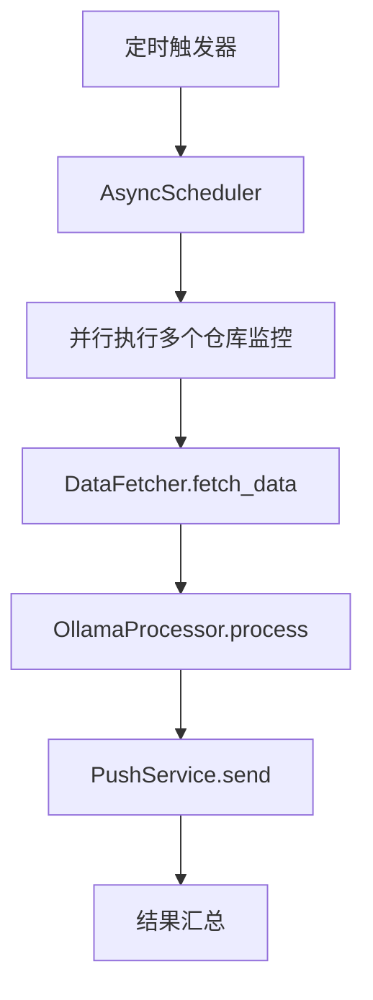

# 信息汇总项目架构设计

## 项目概述
定时通过GitHub/GitLab API获取仓库的commit情况、issue和PR信息，通过Ollama处理后推送到指定服务。

## 核心模块设计

### 1. 配置系统 (`config/`)
**功能**：统一的配置管理和验证
**异步需求**：配置热重载（可选）

```python
# 主要类
- ConfigManager: 配置管理器
- ConfigValidator: 配置验证器
- ConfigLoader: 配置加载器（支持YAML/JSON）

# 配置模型
- RepositoryConfig: 仓库配置
- OllamaConfig: Ollama配置
- PushConfig: 推送配置
- ScheduleConfig: 调度配置
```

### 2. API客户端模块 (`clients/`)
**功能**：封装GitHub/GitLab API调用
**异步需求**：所有网络请求必须异步

```python
# GitHub客户端
- GitHubClient: 异步GitHub API客户端
  - get_commits_since()
  - get_issue_details()
  - get_pull_request_details()

# GitLab客户端  
- GitLabClient: 异步GitLab API客户端
  - get_commits_since()
  - get_merge_request_details()
```

### 3. 数据服务模块 (`services/`)
**功能**：核心业务逻辑处理
**异步需求**：全部异步处理

```python
# 数据获取服务
- DataFetcher: 统一数据获取服务
  - fetch_repository_data()
  - filter_and_process_data()

# Ollama处理服务
- OllamaProcessor: 异步Ollama处理
  - generate_summary()
  - analyze_trends()

# 推送服务
- PushService: 统一推送服务
  - push_to_serverchan()
  - push_to_other_services()
```

### 4. 调度模块 (`scheduler/`)
**功能**：定时任务调度和执行
**异步需求**：任务调度和执行

```python
- CronScheduler: 基于cron的调度器
- TaskExecutor: 任务执行器
```

### 5. 工具模块 (`utils/`)
**功能**：通用工具函数和异步处理框架
**异步需求**：异步任务管理

```python
- AsyncTaskManager: 异步任务管理器
- RetryHandler: 重试处理器
```

## 异步处理框架设计

### 必须异步的过程：
1. **网络I/O密集型操作**
   - GitHub/GitLab API调用
   - 推送服务请求

2. **计算密集型操作**  
   - Ollama模型推理
   - 数据分析和处理

### 异步执行流程：


## 数据模型设计

```python
@dataclass
class RepositoryData:
    repo_name: str
    commits: List[CommitInfo]
    issues: List[IssueInfo]
    pull_requests: List[PRInfo]
    period_start: datetime
    period_end: datetime

@dataclass  
class ProcessedSummary:
    summary_text: str
    key_metrics: Dict[str, Any]
    alerts: List[str]
```

## 配置系统示例

```yaml
repositories:
  - name: "my-project"
    type: "github"
    owner: "my-org"
    repo: "my-project"
    branch: "main"
    token: "${GITHUB_TOKEN}"

  - name: "internal-project"  
    type: "gitlab"
    project_id: "123"
    base_url: "https://gitlab.example.com"
    token: "${GITLAB_TOKEN}"

ollama:
  base_url: "http://localhost:11434"
  model: "llama2"
  system_prompt: "你是一个代码仓库分析助手"

push:
  services:
    - type: "serverchan"
      sendkey: "${SERVERCHAN_SENDKEY}"

schedules:
  - cron: "0 9 * * 1-5"
    repositories: ["my-project", "internal-project"]