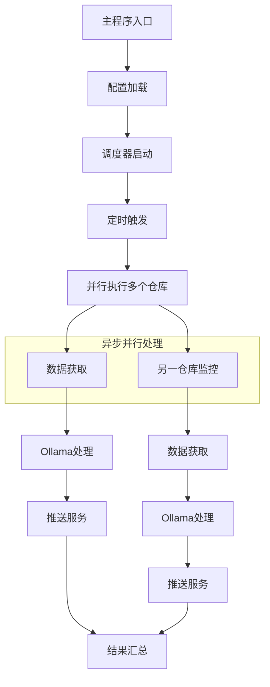

# 项目实施路线图

## 🎯 项目总结

基于您的需求，我已经完成了完整的Python项目架构设计。以下是核心要点：

### 模块划分
1. **配置系统** - 统一配置管理，支持YAML/JSON
2. **API客户端** - GitHub/GitLab异步API封装
3. **数据服务** - 数据获取、过滤、处理
4. **调度系统** - 定时任务管理和执行
5. **工具模块** - 异步处理框架和错误处理

### 异步处理策略
**必须异步的核心过程：**
- 所有网络I/O操作 (API调用、推送服务)
- Ollama模型推理 (计算密集型)
- 并行任务执行 (性能优化)

## 🔄 异步处理设计

## 📋 实施优先级

### Phase 1: 核心框架 (高优先级)
1. 创建项目目录结构
2. 实现配置系统
3. 实现基础数据模型

### Phase 2: API集成 (高优先级)
4. 实现GitHub客户端
5. 实现GitLab客户端

### Phase 3: 业务逻辑 (中优先级)
6. 实现数据获取服务
7. 实现Ollama处理模块

### Phase 3: 调度和推送 (中优先级)
8. 实现定时调度器
9. 实现推送服务

### Phase 4: 完善功能 (低优先级)
10. 错误处理和重试机制
11. CLI接口和文档

## 🛠️ 技术选型

- **异步框架**: `asyncio` + `aiohttp`
- **配置格式**: YAML (支持环境变量)
- **调度系统**: `croniter`
- **AI处理**: `ollama` Python库
- **推送服务**: `serverchan-sdk` + 自定义Webhook

## ⚡ 性能优化点

1. **连接池复用** - aiohttp ClientSession
2. **并行处理** - asyncio.gather()
3. **缓存策略** - 避免重复API调用
4. **限流控制** - GitHub/GitLab API限流处理

## 🚀 扩展性设计

- **插件化架构** - 易于添加新的数据源和推送服务
- **配置驱动** - 无需代码修改即可调整监控策略
- **模块化设计** - 各模块独立，便于测试和维护